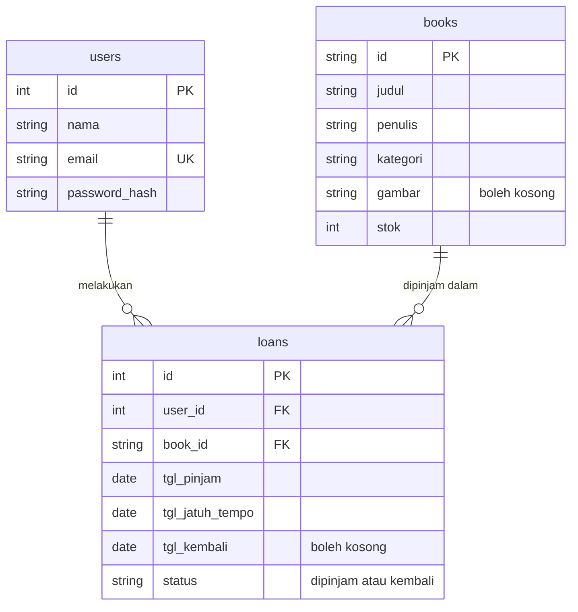

# ERD PustakaKita

```mermaid
erDiagram
    users ||--o{ loans : "melakukan"
    books ||--o{ loans : "dipinjam dalam"

    users {
        int id PK
        string nama
        string email UK
        string password_hash
    }
    books {
        string id PK
        string judul
        string penulis
        string kategori
        string gambar "boleh kosong"
        int stok
    }
    loans {
        int id PK
        int user_id FK
        string book_id FK
        date tgl_pinjam
        date tgl_jatuh_tempo
        date tgl_kembali "boleh kosong"
        string status "dipinjam atau kembali"
    }
```

## Relasi

- Satu user dapat memiliki banyak peminjaman (1 ke N).
- Satu buku dapat tercatat di banyak peminjaman (1 ke N).
